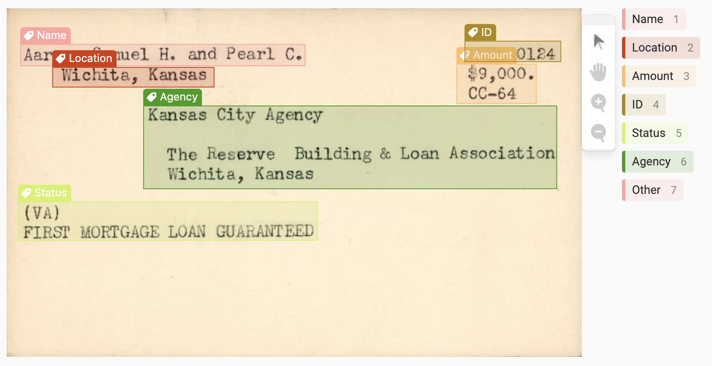

# G.I. Bill

This repository contains code to extract structured text about GI Bill mortgages from scanned index cards. The approach uses existing libraries including Label Studio to label training data, Detectron2 to train a deep-learning model for image analysis, Layout Parser for layout detection, and Tesseract for optical character recognition.

**Approach**:

1. Define problem, annotation scheme, and target
2. Label data, split, and train custom layout model
3. Predict and evaluate bounding boxes (DIA)
4. Extract text inside bounding boxes (OCR)
5. Structure output and extract entities (NER) - *in progress*

## /downloaded-annotations

Examples of cards annotated in [Label Studio](https://labelstud.io/)
* Scanned cards (`/images`)
* Annotations used for training (`result.json`)

## /layout-model-training/scripts

Scripts to train custom model with Layout Parser and extract text with Tesseract
* Apply model extract text from cards (`extract_cards.sh`; `extract_script.sbat`)
* Train a custom layout detection model (`train_cards.sh`; `job_script.sbat`)

## /notebooks

Programs and demonstrations implementing custom model
* Visualize card layout detection with custom model (`custom-model.ipynb`)
* Program to apply custom model to extract text from cards (`layout-workflow.py`)
* Program to test system configuration on Great Lakes HPC for Tesseract (`test-tesseract.py`)
